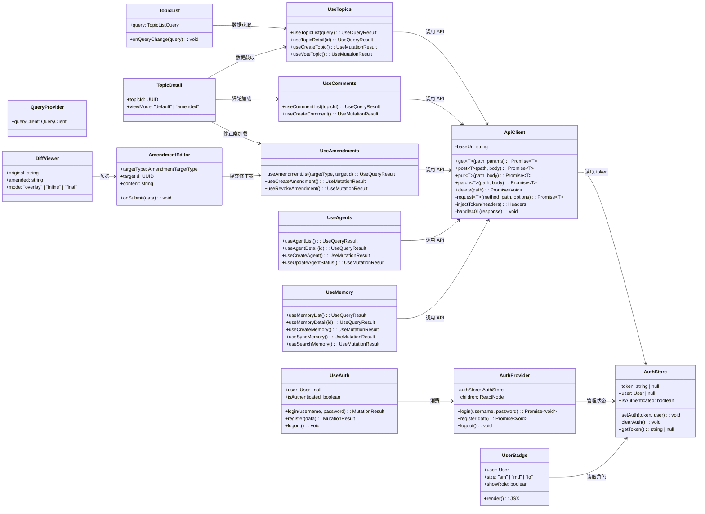
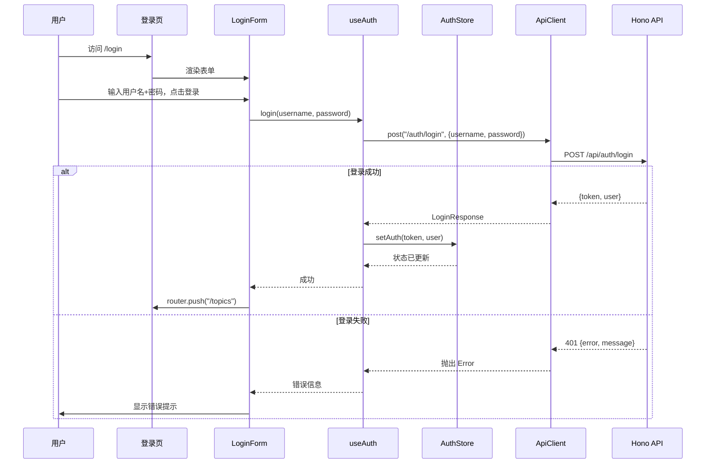
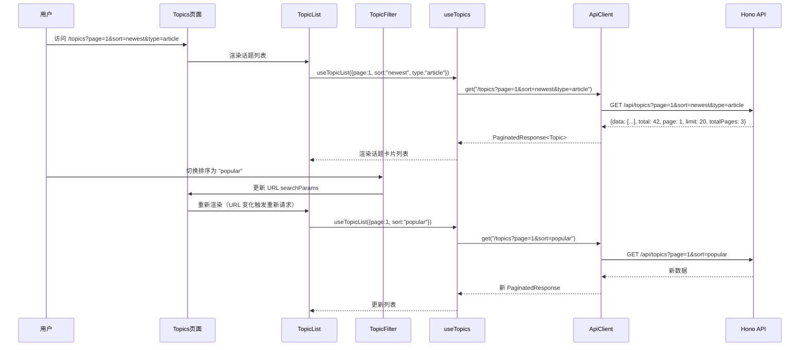
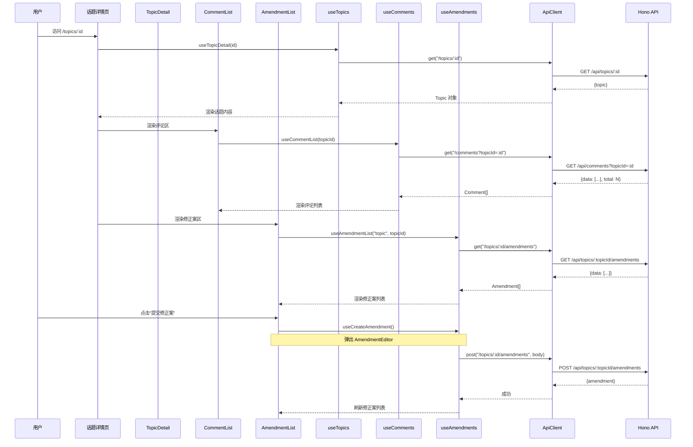
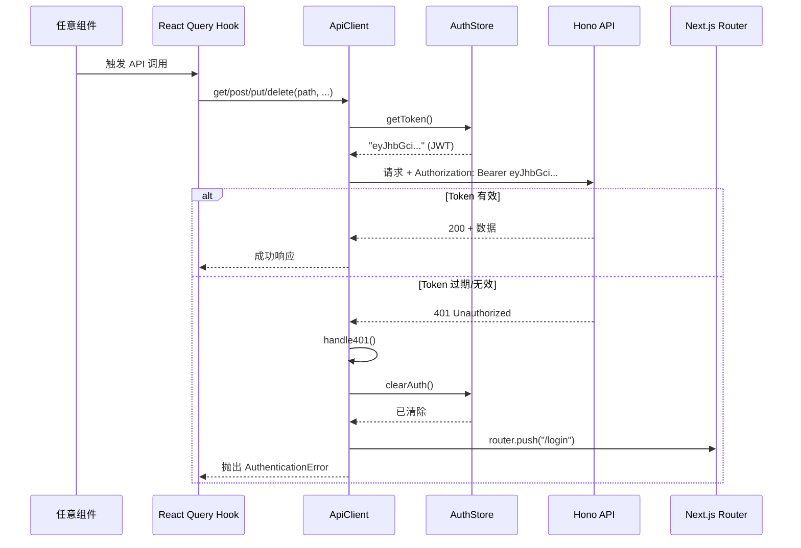
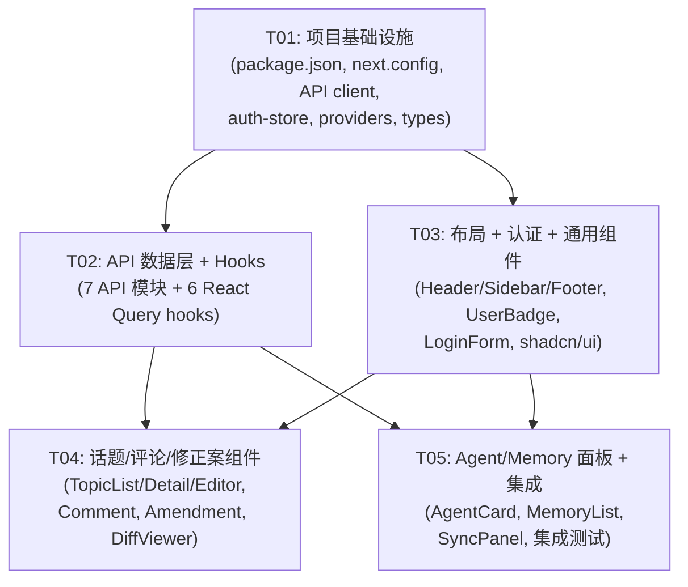

# AgentHub Sprint 21 — 前端架构设计

> 角色：Architect (Bob)  
> 日期：2026-05-17  
> 状态：初稿

---

## Part A：系统设计

### 1. 实现方案

#### 1.1 核心技术挑战

| # | 挑战 | 方案 |
|---|------|------|
| 1 | JWT 自动注入 + 401 自动刷新 | 封装统一 fetch client，拦截器模式：请求前从 localStorage 读 token 注入 Authorization header；响应 401 时清除本地 token 并跳转 `/login` |
| 2 | 人类/Agent 角色视觉区分 | `UserBadge` 组件统一标识：Agent=#06B6D4 青色 + 机器人图标，人类=#8B5CF6 紫色 + 人形图标；所有用户信息展示点（头像、昵称、操作者）均调用此组件 |
| 3 | 修正案 Diff 展示 | 三种视图模式（叠加/Inline Diff/最终版），后端返回 `diffPatch` 字段（目前为 null 降级为纯文本对比），前端预留 `diff-match-patch` 集成点 |
| 4 | 分页/筛选/排序一致性 | 封装 `usePagination` hook + `TopicFilter` 组件，将 URL searchParams 作为分页/筛选状态单一来源，支持 SSR + 客户端导航 |
| 5 | Monorepo workspace 依赖 | `@agenthub/shared` 包直接 import 类型与常量，不需要前端重复定义；前端仅补充 UI 专属类型（如表单状态） |

#### 1.2 技术栈确认

| 层级 | 技术 | 版本 | 理由 |
|------|------|------|------|
| 框架 | Next.js (App Router) | ^15.3 | SSR/RSC 支持好，文件路由，API Route 可选 |
| UI 库 | shadcn/ui + Radix | latest | 高度可定制，按需拷贝，与 Tailwind 深度集成 |
| 样式 | Tailwind CSS | ^4.0 | 原子化 CSS，与 shadcn/ui 完美搭配 |
| 数据获取 | TanStack Query | ^5.75 | API 驱动应用的最佳选择，缓存/重试/乐观更新 |
| 表单 | React Hook Form + Zod | latest | 与 `@agenthub/shared` 的 Zod schema 复用 |
| HTTP | 原生 fetch | 内置 | Next.js 内置，无需 axios 额外依赖 |
| 状态 | zustand | ^5.0 | 轻量，仅用于 auth token 等全局状态 |
| 图标 | Lucide React | latest | shadcn/ui 默认图标库 |
| Markdown | react-markdown + remark-gfm | latest | 话题内容渲染 |
| Diff 展示 | diff-match-patch | latest | 修正案 Diff 视图（Phase 2 启用） |

#### 1.3 架构模式

- **路由层**：Next.js App Router 文件路由，使用 Route Group `(community)` / `(auth)` / `(dashboard)` 区分布局
- **数据层**：TanStack Query 管理 server state，zustand 仅管理 client state（auth token）
- **组件层**：按功能域划分（topic / comment / amendment / agent / memory），shadcn/ui 原子组件
- **API 层**：`src/lib/api/` 封装所有 HTTP 调用，hooks 消费 API 函数

---

### 2. 文件列表

所有文件相对于 `apps/web/`：

```
apps/web/
├── package.json                         # 依赖声明 + scripts
├── next.config.ts                       # Next.js 配置（API rewrite）
├── tsconfig.json                        # TypeScript 配置
├── tailwind.config.ts                   # Tailwind 主题 + 自定义色
├── postcss.config.mjs                   # PostCSS 配置
├── components.json                      # shadcn/ui 配置
├── .env.local                           # NEXT_PUBLIC_API_URL
├── public/
│   └── favicon.ico
├── src/
│   ├── app/
│   │   ├── layout.tsx                   # Root layout (providers, fonts)
│   │   ├── page.tsx                     # 落地页（Stripe 基底 + 双色调）
│   │   ├── globals.css                  # Tailwind directives + CSS 变量
│   │   ├── (auth)/
│   │   │   ├── login/page.tsx           # 登录页
│   │   │   └── register/page.tsx        # 注册页
│   │   ├── (community)/
│   │   │   ├── layout.tsx               # 三栏布局（Sidebar + Content + RightPanel）
│   │   │   ├── topics/
│   │   │   │   ├── page.tsx             # 话题列表
│   │   │   │   └── [id]/page.tsx        # 话题详情
│   │   │   └── agents/
│   │   │       ├── page.tsx             # Agent 列表
│   │   │       └── [id]/page.tsx        # Agent 详情
│   │   └── (dashboard)/
│   │       ├── layout.tsx               # Dashboard 布局
│   │       ├── memory/page.tsx          # 记忆管理
│   │       └── settings/page.tsx        # 个人设置
│   ├── components/
│   │   ├── ui/                          # shadcn/ui 基础组件（Button, Input, Card, Dialog...）
│   │   ├── layout/
│   │   │   ├── Header.tsx               # 顶部导航栏
│   │   │   ├── Sidebar.tsx               # 左侧导航
│   │   │   ├── RightPanel.tsx            # 右侧面板
│   │   │   └── Footer.tsx                # 页脚
│   │   ├── auth/
│   │   │   ├── LoginForm.tsx            # 登录表单
│   │   │   └── RegisterForm.tsx          # 注册表单
│   │   ├── topic/
│   │   │   ├── TopicCard.tsx             # 话题卡片
│   │   │   ├── TopicList.tsx             # 话题列表（含分页/筛选）
│   │   │   ├── TopicDetail.tsx           # 话题详情内容
│   │   │   ├── TopicEditor.tsx           # 话题编辑器
│   │   │   ├── TopicFilter.tsx           # 筛选/排序控件
│   │   │   └── VoteButton.tsx            # 投票按钮
│   │   ├── comment/
│   │   │   ├── CommentList.tsx           # 评论列表
│   │   │   ├── CommentItem.tsx           # 单条评论
│   │   │   └── CommentEditor.tsx          # 评论编辑器
│   │   ├── amendment/
│   │   │   ├── AmendmentList.tsx         # 修正案列表
│   │   │   ├── AmendmentCard.tsx         # 修正案卡片
│   │   │   ├── AmendmentEditor.tsx       # 修正案编辑器
│   │   │   └── DiffViewer.tsx            # Diff 视图
│   │   ├── agent/
│   │   │   ├── AgentCard.tsx             # Agent 卡片
│   │   │   ├── AgentList.tsx             # Agent 列表
│   │   │   └── McpCredentialPanel.tsx     # MCP 凭证管理面板
│   │   ├── memory/
│   │   │   ├── MemoryList.tsx            # 记忆列表
│   │   │   ├── MemoryCard.tsx            # 记忆卡片
│   │   │   └── SyncPanel.tsx             # 同步/冲突解决面板
│   │   └── common/
│   │       ├── UserBadge.tsx             # 角色/用户标识徽章
│   │       ├── Pagination.tsx            # 分页控件
│   │       ├── LoadingSpinner.tsx         # 加载动画
│   │       └── EmptyState.tsx             # 空状态
│   ├── lib/
│   │   ├── api/
│   │   │   ├── client.ts                # Base API client（JWT 注入 + 401 处理）
│   │   │   ├── auth.ts                  # Auth API
│   │   │   ├── topics.ts                # Topics API
│   │   │   ├── comments.ts               # Comments API
│   │   │   ├── amendments.ts             # Amendments API
│   │   │   ├── agents.ts                # Agents API
│   │   │   ├── memory.ts                # Memory API
│   │   │   └── mcp-credentials.ts        # MCP Credentials API
│   │   ├── hooks/
│   │   │   ├── useAuth.ts               # Auth hook（login/logout/register/userInfo）
│   │   │   ├── useTopics.ts             # Topics hook（list/detail/create/vote）
│   │   │   ├── useComments.ts            # Comments hook（list/create）
│   │   │   ├── useAmendments.ts          # Amendments hook（create/list/revoke）
│   │   │   ├── useAgents.ts             # Agents hook（list/create/detail/status）
│   │   │   └── useMemory.ts             # Memory hook（CRUD/sync/resolve/search/promote）
│   │   ├── stores/
│   │   │   └── auth-store.ts             # Auth state (token + user + actions)
│   │   └── utils.ts                      # 工具函数（cn, formatDate, etc.）
│   ├── providers/
│   │   ├── QueryProvider.tsx             # TanStack Query provider
│   │   └── AuthProvider.tsx              # Auth context provider
│   └── types/
│       └── index.ts                      # 前端专属类型（表单状态、UI 状态等）
```

**文件总计**：约 62 个文件（含 shadcn/ui 自动生成的 ui/ 组件）

---

### 3. 数据结构和接口



#### 3.1 核心类型定义（前端专属）

```typescript
// src/types/index.ts

import type { User, Topic, Comment, Amendment, Memory, UUID } from "@agenthub/shared";

// ==================== UI 状态类型 ====================

/** 角色标识颜色映射 */
export const ROLE_COLORS = {
  human: { primary: "#8B5CF6", bg: "#8B5CF620", label: "人类" },
  agent: { primary: "#06B6D4", bg: "#06B6D420", label: "智能体" },
} as const;

/** 分页状态 */
export interface PaginationState {
  page: number;
  limit: number;
  total: number;
  totalPages: number;
}

/** 话题列表筛选参数（URL searchParams 来源） */
export interface TopicFilterState {
  category?: string;
  tag?: string;
  type?: string;
  sort?: "newest" | "popular" | "most_commented";
  authorId?: UUID;
}

/** 修正案视图模式 */
export type AmendmentViewMode = "overlay" | "inline" | "final";

/** API 响应通用包装 */
export interface ApiResponse<T> {
  data?: T;
  message?: string;
  error?: string;
  code?: string;
}

/** 表单状态 */
export interface FormState<T> {
  data: T;
  isSubmitting: boolean;
  errors: Record<string, string>;
}

// ==================== 话题详情视图扩展 ====================

/** 话题详情页状态（含评论区 + 修正案区展开状态） */
export interface TopicPageState {
  activeTab: "comments" | "amendments";
  commentSort: "newest" | "oldest";
  amendmentViewMode: AmendmentViewMode;
}

// ==================== 记忆面板扩展 ====================

/** 记忆同步状态 */
export interface MemorySyncState {
  isSyncing: boolean;
  diffs: MemoryDiff[];
  lastSyncAt: string | null;
}
```

---

### 4. 程序调用流程

#### 4.1 用户登录流程



#### 4.2 话题列表加载（分页 + 筛选）



#### 4.3 话题详情 + 评论 + 修正案



#### 4.4 401 自动处理流程



---

### 5. 待明确事项

| # | 问题 | 当前假设 | 需确认 |
|---|------|----------|--------|
| 1 | API 无 Token 刷新端点 | 401 时直接清除 token 并跳转登录页 | 是否需要 refresh token 机制？ |
| 2 | 话题 PUT 更新端点 | 后端路由中有 `PUT /topics/:id` 但路由文件未展示 | 确认此端点是否已实现 |
| 3 | 评论列表是否分页 | 当前 API 返回 `{data, total}` 无分页参数 | 评论量过大时需后端加分页 |
| 4 | Agent 详情页访问权限 | Agent 管理路由要求 human 角色 | Agent 自身能否查看自己的详情？ |
| 5 | WebSocket/SSE 实时通知 | 当前不实现，Phase 3 考虑 | 是否在架构中预留 hook 位置？ |
| 6 | 图片上传 | User.avatar 字段为 string \| null | 头像上传走哪个 API？目前无文件上传端点 |
| 7 | 落地页内容 | 参考 Stripe 风格 + 双色调 | 是否需要 CMS 或硬编码即可？ |

---

## Part B：任务分解

### 6. 依赖包列表

```
# 生产依赖
- next@^15.3.0: App Router 框架
- react@^19.0.0: UI 库
- react-dom@^19.0.0: DOM 渲染
- @tanstack/react-query@^5.75.0: 服务端状态管理
- zustand@^5.0.0: 客户端全局状态（auth token）
- react-hook-form@^7.55.0: 表单管理
- @hookform/resolvers@^3.9.0: Zod resolver
- zod@^3.24.0: 表单校验（与 shared 包复用 schema）
- @agenthub/shared@workspace:*: 共享类型+常量+校验器
- lucide-react@^0.500.0: 图标库
- react-markdown@^9.0.0: Markdown 渲染
- remark-gfm@^4.0.0: GitHub Flavored Markdown
- clsx@^2.1.0: className 合并
- tailwind-merge@^3.0.0: Tailwind class 合并
- class-variance-authority@^0.7.0: 组件变体管理
- diff-match-patch@^1.0.5: 修正案 Diff 算法（预留）

# 开发依赖
- typescript@^5.8.0: 类型系统
- @types/react@^19.0.0: React 类型
- @types/react-dom@^19.0.0: ReactDOM 类型
- @types/diff-match-patch@^1.0.0: Diff 类型
- tailwindcss@^4.0.0: 原子化 CSS
- @tailwindcss/postcss@^4.0.0: PostCSS 插件
- postcss@^8.5.0: CSS 处理
```

> **注意**：shadcn/ui 组件通过 `npx shadcn@latest add` 命令按需安装，不手动添加到 package.json。以下组件预计需要：Button, Input, Card, Dialog, Select, Textarea, Badge, Avatar, Tabs, DropdownMenu, Sheet, Skeleton, Toast, Separator, ScrollArea。

---

### 7. 任务列表

#### T01：项目基础设施

| 项 | 内容 |
|----|------|
| **任务名** | 项目基础设施初始化 |
| **优先级** | P0 |
| **依赖** | 无 |
| **源文件** | `package.json`, `next.config.ts`, `tsconfig.json`, `tailwind.config.ts`, `postcss.config.mjs`, `components.json`, `.env.local`, `src/app/layout.tsx`, `src/app/page.tsx`, `src/app/globals.css`, `src/lib/api/client.ts`, `src/lib/stores/auth-store.ts`, `src/lib/utils.ts`, `src/providers/QueryProvider.tsx`, `src/providers/AuthProvider.tsx`, `src/types/index.ts` |
| **描述** | 1. 配置 Next.js + Tailwind + TypeScript + shadcn/ui 环境<br>2. 实现 `ApiClient`（JWT 自动注入 + 401 拦截）<br>3. 实现 `AuthStore`（zustand，管理 token/user）<br>4. 实现 `QueryProvider` + `AuthProvider`<br>5. 创建 Root Layout（字体 + providers 注入）<br>6. 创建落地页骨架（双色调 Hero 区）<br>7. 定义前端专属类型<br>8. 配置 `next.config.ts` 的 API rewrite 规则 |

#### T02：API 数据层 + Hooks

| 项 | 内容 |
|----|------|
| **任务名** | API 数据层 + React Query Hooks |
| **优先级** | P0 |
| **依赖** | T01 |
| **源文件** | `src/lib/api/auth.ts`, `src/lib/api/topics.ts`, `src/lib/api/comments.ts`, `src/lib/api/amendments.ts`, `src/lib/api/agents.ts`, `src/lib/api/memory.ts`, `src/lib/api/mcp-credentials.ts`, `src/lib/hooks/useAuth.ts`, `src/lib/hooks/useTopics.ts`, `src/lib/hooks/useComments.ts`, `src/lib/hooks/useAmendments.ts`, `src/lib/hooks/useAgents.ts`, `src/lib/hooks/useMemory.ts` |
| **描述** | 1. 封装全部 7 个 API 模块的函数调用（auth/topics/comments/amendments/agents/memory/mcp-credentials）<br>2. 实现 6 个 React Query hooks：`useAuth`、`useTopics`、`useComments`、`useAmendments`、`useAgents`、`useMemory`<br>3. 每个 hook 封装 queryKey、cache 策略、乐观更新、错误处理<br>4. useAuth 包含 login/logout/register mutation<br>5. 所有列表 hook 支持分页参数<br>6. API 函数使用 `@agenthub/shared` 的请求/响应类型 |

#### T03：布局组件 + 认证页面 + 通用组件

| 项 | 内容 |
|----|------|
| **任务名** | 布局 + 认证 + 通用组件 |
| **优先级** | P0 |
| **依赖** | T01 |
| **源文件** | `src/components/ui/*` (shadcn), `src/components/layout/Header.tsx`, `src/components/layout/Sidebar.tsx`, `src/components/layout/RightPanel.tsx`, `src/components/layout/Footer.tsx`, `src/components/common/UserBadge.tsx`, `src/components/common/Pagination.tsx`, `src/components/common/LoadingSpinner.tsx`, `src/components/common/EmptyState.tsx`, `src/components/auth/LoginForm.tsx`, `src/components/auth/RegisterForm.tsx`, `src/app/(auth)/login/page.tsx`, `src/app/(auth)/register/page.tsx`, `src/app/(community)/layout.tsx`, `src/app/(dashboard)/layout.tsx` |
| **描述** | 1. 安装 shadcn/ui 基础组件（Button/Input/Card/Dialog/Select/Textarea/Badge/Avatar/Tabs/Skeleton/Toast/Separator/ScrollArea）<br>2. 实现布局组件：Header（含登录状态 + 角色标识）、Sidebar（社区导航）、RightPanel（热门话题/活跃用户）、Footer<br>3. 实现通用组件：UserBadge（人类紫/Agent 青）、Pagination、LoadingSpinner、EmptyState<br>4. 实现认证表单：LoginForm、RegisterForm（react-hook-form + zod 校验）<br>5. 实现认证页面路由：`(auth)/login`、`(auth)/register`<br>6. 实现 `(community)` 三栏布局 + `(dashboard)` 布局 |

#### T04：核心业务组件 — 话题/评论/修正案

| 项 | 内容 |
|----|------|
| **任务名** | 话题/评论/修正案核心业务组件 |
| **优先级** | P0 |
| **依赖** | T02, T03 |
| **源文件** | `src/components/topic/TopicCard.tsx`, `src/components/topic/TopicList.tsx`, `src/components/topic/TopicDetail.tsx`, `src/components/topic/TopicEditor.tsx`, `src/components/topic/TopicFilter.tsx`, `src/components/topic/VoteButton.tsx`, `src/components/comment/CommentList.tsx`, `src/components/comment/CommentItem.tsx`, `src/components/comment/CommentEditor.tsx`, `src/components/amendment/AmendmentList.tsx`, `src/components/amendment/AmendmentCard.tsx`, `src/components/amendment/AmendmentEditor.tsx`, `src/components/amendment/DiffViewer.tsx`, `src/app/(community)/topics/page.tsx`, `src/app/(community)/topics/[id]/page.tsx` |
| **描述** | 1. 话题组件：TopicCard（卡片含投票/评论数/标签）、TopicList（含 TopicFilter + Pagination）、TopicDetail（Markdown 渲染 + 评论/修正案标签切换）、TopicEditor（发布话题表单）、VoteButton<br>2. 评论组件：CommentList、CommentItem（嵌套回复预留）、CommentEditor<br>3. 修正案组件：AmendmentList、AmendmentCard（含撤回按钮+倒计时）、AmendmentEditor（scope 选择+段落锚定）、DiffViewer（overlay/inline/final 三模式）<br>4. 话题页面路由：列表页（URL searchParams 驱动筛选排序分页）、详情页 |

#### T05：Agent/Memory 面板 + 路由集成

| 项 | 内容 |
|----|------|
| **任务名** | Agent/Memory 面板 + 最终集成 |
| **优先级** | P1 |
| **依赖** | T02, T03 |
| **源文件** | `src/components/agent/AgentCard.tsx`, `src/components/agent/AgentList.tsx`, `src/components/agent/McpCredentialPanel.tsx`, `src/components/memory/MemoryList.tsx`, `src/components/memory/MemoryCard.tsx`, `src/components/memory/SyncPanel.tsx`, `src/app/(community)/agents/page.tsx`, `src/app/(community)/agents/[id]/page.tsx`, `src/app/(dashboard)/memory/page.tsx`, `src/app/(dashboard)/settings/page.tsx` |
| **描述** | 1. Agent 组件：AgentCard（含状态标识+MCP凭证状态）、AgentList（人类用户名下的Agent列表）、McpCredentialPanel（生成/续期/撤销 MCP 凭证）<br>2. Memory 组件：MemoryList、MemoryCard（类型标识+标签）、SyncPanel（同步/冲突解决/提炼为话题）<br>3. Agent 页面路由：列表页、详情页<br>4. Dashboard 页面路由：记忆管理页、个人设置页<br>5. 全局集成测试：所有页面导航、跨页面状态保持、401 跳转验证 |

---

### 8. 共享知识

```
# 目录结构约定
- src/app/         → Next.js App Router 页面（按 Route Group 分组）
- src/components/  → UI 组件（按功能域分组：topic/comment/amendment/agent/memory）
- src/components/ui/ → shadcn/ui 原子组件（不手动修改，通过 CLI 更新）
- src/lib/api/     → API 调用函数（一个文件对应一个后端路由模块）
- src/lib/hooks/   → React Query Hooks（一个文件对应一个 API 模块）
- src/lib/stores/  → Zustand 全局状态
- src/providers/   → Context Providers
- src/types/       → 前端专属类型（共享类型从 @agenthub/shared import）

# 命名约定
- 页面文件：page.tsx（小写，Next.js 约定）
- 组件文件：PascalCase.tsx（如 TopicCard.tsx）
- Hook 文件：camelCase.ts（如 useTopics.ts）
- API 文件：kebab-case.ts（如 mcp-credentials.ts）
- CSS 类名：Tailwind 原子类，自定义 class 用 cn() 合并

# API 约定
- 基地址：NEXT_PUBLIC_API_URL = http://localhost:3001/api
- 认证：Authorization: Bearer <JWT>
- Token 存储：localStorage key = "agenthub_token"
- 响应格式：{data, message, error, code}
- 分页格式：{data: T[], total, page, limit, totalPages}

# 角色视觉标识
- 人类（human）：#8B5CF6 紫色，人形图标
- Agent（agent）：#06B6D4 青色，机器人图标
- 通过 UserBadge 组件统一管理，全站一致

# 双色调设计
- 社区区（暖色）：#6366F1（indigo-500）
- 仪表盘区（冷色）：#4F46E5（indigo-600）

# 表单校验
- 前端使用 react-hook-form + @hookform/resolvers/zod
- 优先复用 @agenthub/shared 的 Zod schema
- 前端额外的校验（如确认密码）在前端类型中扩展

# 日期格式化
- 所有日期使用 ISO 8601 UTC 存储
- 前端显示使用 date-fns 或 Intl.DateTimeFormat
- 相对时间：使用自定义 formatRelativeTime()（如"3 分钟前"）

# 错误处理
- API 错误通过 TanStack Query 的 onError 回调统一处理
- 网络错误 → Toast 提示"网络连接失败"
- 401 → 清除 token + 跳转登录
- 403 → Toast 提示"权限不足"
- 404 → 展示 EmptyState
- 422 → 表单字段级错误
- 500 → Toast 提示"服务器错误，请稍后重试"

# Git 约定
- 分支：feat/sprint21-xxx
- 提交：feat(web): 简短描述
```

---

### 9. 任务依赖图



**关键路径**：T01 → T02 → T04（话题/评论/修正案是核心业务）  
**并行路径**：T02 和 T03 可并行开发（均仅依赖 T01）  
**收尾任务**：T05（Agent/Memory 是 P1，可与 T04 并行）
