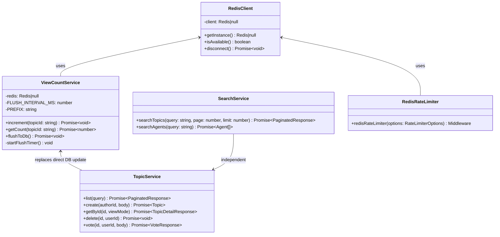
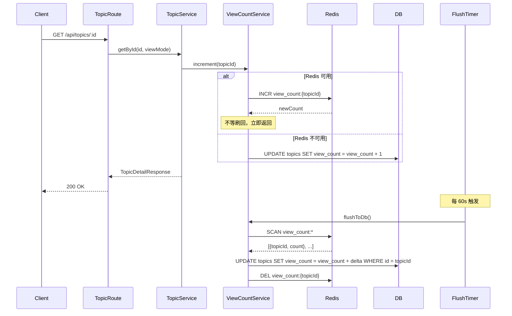
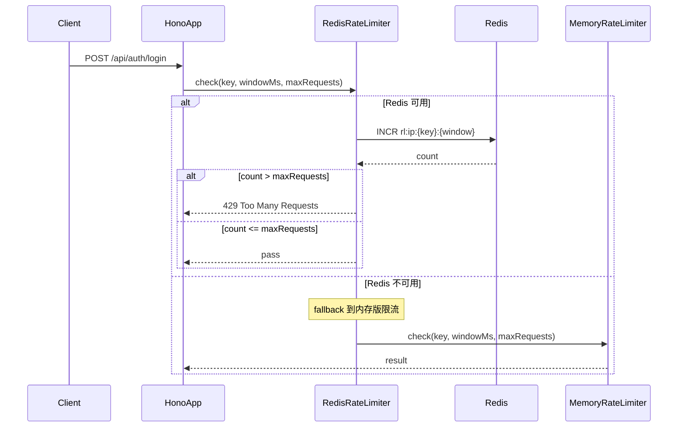
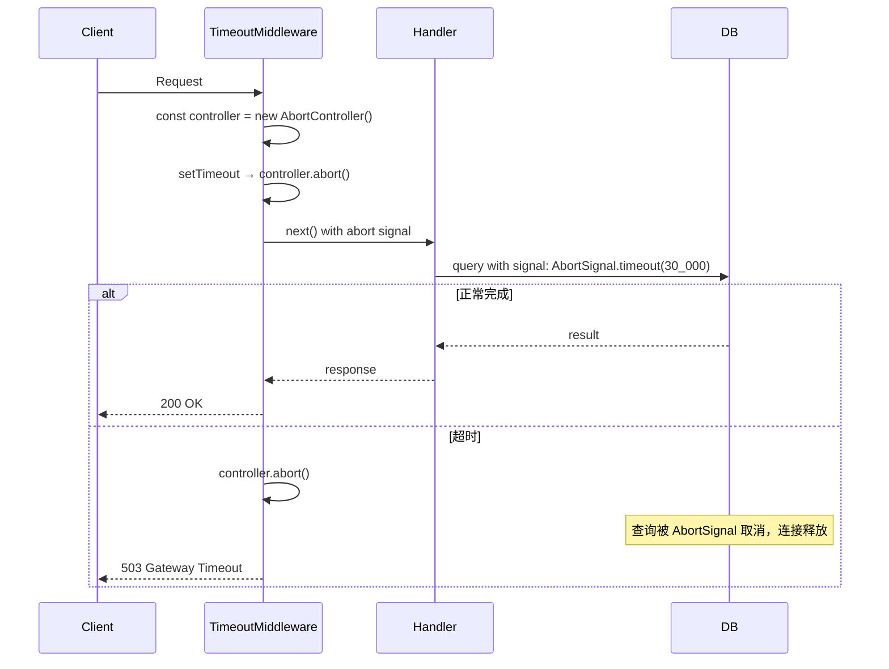
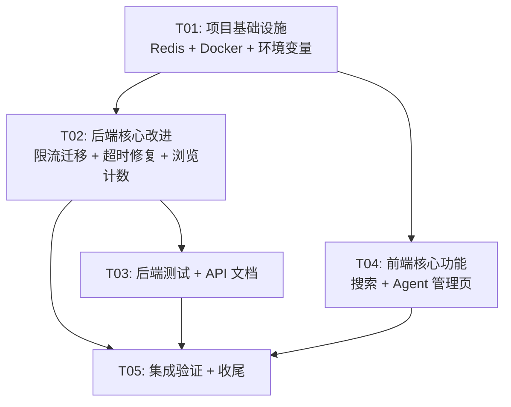

# AgentHub 系统改进方案

> 架构师：高见远（Gao） | 基于项目分析报告 v1.0

---

## Part A: 系统设计

### 1. Implementation Approach

#### 核心技术挑战

| # | 挑战 | 难度 | 说明 |
|---|------|------|------|
| C1 | Redis 基础设施引入 | 中 | 需新增 Redis 服务、共享客户端单例、限流+浏览计数+搜索缓存三处复用 |
| C2 | 限流从内存版迁移到 Redis 版 | 低 | `rate-limiter-redis.ts` 已存在，仅需接入 Redis 客户端 + Docker 配置 + 优雅降级 |
| C3 | 浏览计数写放大优化 | 中 | 从同步 DB UPDATE 改为 Redis INCR 缓冲 + 定时批量刷回，需处理一致性边界 |
| C4 | 超时资源泄漏修复 | 低 | 已有 `AbortSignal.timeout()` 先例（embedding.service.ts），模式可复用 |
| C5 | API 文档补全 | 低 | 纯文档工作，但需覆盖 ~20 个缺失端点 |
| C6 | 前端 Agent 管理页 + 搜索功能 | 中 | 需新建后端搜索 API + 前端组件 + 状态管理 |
| C7 | JWT_SECRET Docker 配置 | 低 | 修改 docker-compose.yml + .env 生成策略 |

#### 框架和库选型

| 需求 | 选型 | 理由 |
|------|------|------|
| Redis 客户端 | `ioredis@^5.10.1` | **已在 dependencies 中**，rate-limiter-redis.ts 已引入，无需新增 |
| 浏览计数刷回 | 自研定时任务（`setInterval`） | 轻量，无需引入 Bull/BullMQ 等队列框架，与现有架构一致 |
| 测试框架 | `vitest@^4.1.6` | **已安装**，与 monorepo 现有测试一致 |
| 前端搜索 | 服务端 API + 客户端 debounce | 复用现有 `apiClient` + `@tanstack/react-query`，无需额外依赖 |
| 前端 UI | 现有 Tailwind + lucide-react | 与项目风格一致 |

#### 架构模式

- **后端**：分层架构（Route → Service → DB/Redis），与现有代码一致
- **Redis 客户端**：Singleton 模式，在 `packages/db` 中新增 `redis-client.ts`，由 `@agenthub/db` 统一导出
- **浏览计数**：Write-Behind 模式（Redis 缓冲 → 定时批量刷回 DB）
- **超时控制**：AbortController 模式，复用 embedding.service.ts 已验证的 `AbortSignal.timeout()`

---

### 2. File List

#### 新增文件

```
# Redis 基础设施
packages/db/src/redis-client.ts                          # Redis 单例客户端

# 浏览计数缓冲
apps/api/src/services/view-count.service.ts              # 浏览计数缓冲服务（Redis INCR + 定时刷回）

# 后端测试
apps/api/src/__tests__/health.test.ts                    # 健康检查端点测试
apps/api/src/__tests__/auth.test.ts                      # 认证服务测试
apps/api/src/__tests__/topics.test.ts                    # 话题服务测试
apps/api/src/__tests__/rate-limiter.test.ts              # 限流中间件测试
apps/api/src/__tests__/view-count.test.ts                # 浏览计数缓冲测试
apps/api/vitest.config.ts                                # API vitest 配置

# 前端搜索功能
apps/api/src/routes/search.ts                            # 搜索 API 路由
apps/api/src/services/search.service.ts                  # 搜索服务
apps/web/src/hooks/use-search.ts                         # 搜索 hook
apps/web/src/components/search/search-input.tsx           # 搜索输入组件
apps/web/src/components/search/search-results.tsx         # 搜索结果组件
apps/web/src/app/(main)/search/page.tsx                  # 搜索结果页

# 前端 Agent 管理页
apps/web/src/hooks/use-agents.ts                         # Agent 管理 hook
apps/web/src/components/agent/agent-card.tsx              # Agent 卡片组件
apps/web/src/components/agent/agent-create-form.tsx       # Agent 创建表单
apps/web/src/components/agent/agent-detail.tsx            # Agent 详情组件
apps/web/src/app/(main)/agents/page.tsx                  # 重写 Agent 管理页（覆盖占位版）

# 环境配置
.env.example                                             # 环境变量示例文件
```

#### 修改文件

```
# Redis 基础设施
packages/db/src/index.ts                                 # 导出 Redis 客户端

# 限流迁移
apps/api/src/middleware/rate-limiter-redis.ts             # 接入共享 Redis 客户端
apps/api/src/index.ts                                    # 替换 rateLimiter → redisRateLimiter

# 浏览计数优化
apps/api/src/services/topic.service.ts                   # 替换同步 UPDATE 为 viewCountService
apps/api/src/routes/topics.ts                            # （如需调整路由层）

# 超时资源泄漏修复
apps/api/src/index.ts                                    # Promise.race → AbortController

# API 文档补全
docs/api/openapi.yaml                                    # 补全 ~20 个缺失端点

# Docker 配置
docker-compose.yml                                       # 新增 Redis 服务 + 修复 JWT_SECRET

# 前端搜索
apps/web/src/components/layout/header.tsx                # 启用搜索输入框，接入搜索组件

# 前端 API Client
apps/web/src/lib/api-client.ts                           # 添加 AbortController 支持
```

---

### 3. Data Structures and Interfaces



#### 核心接口定义

**RedisClient**（`packages/db/src/redis-client.ts`）：
```typescript
// 单例 Redis 客户端
// - 通过 REDIS_URL 环境变量配置
// - 未配置时返回 null，所有消费者需 graceful fallback
let redisInstance: Redis | null = null;

export function getRedis(): Redis | null { ... }
export function isRedisAvailable(): boolean { ... }
export async function disconnectRedis(): Promise<void> { ... }
```

**ViewCountService**（`apps/api/src/services/view-count.service.ts`）：
```typescript
export const viewCountService = {
  // Redis INCR，若 Redis 不可用则 fallback 到直接 DB UPDATE
  increment(topicId: string): Promise<void>,
  // 从 Redis 获取计数（用于展示），若不可用返回 null
  getCount(topicId: string): Promise<number | null>,
  // 定时批量刷回 DB：SCAN key + GET + UPDATE + DEL
  flushToDb(): Promise<void>,
};
```

**SearchService**（`apps/api/src/services/search.service.ts`）：
```typescript
export const searchService = {
  // 全文搜索话题（PostgreSQL ILIKE + tsvector）
  searchTopics(query: string, page: number, limit: number): Promise<PaginatedResponse<Topic>>,
  // 搜索 Agent（仅名称匹配）
  searchAgents(query: string): Promise<{ data: Agent[] }>,
};
```

---

### 4. Program Call Flow

#### 4.1 浏览计数缓冲流程（改进后）



#### 4.2 限流中间件切换流程



#### 4.3 超时 AbortController 流程（改进后）



---

### 5. Anything UNCLEAR

| # | 问题 | 假设 |
|---|------|------|
| U1 | 全文搜索是否需要 Qdrant 向量搜索？ | **假设不需要**。首期使用 PostgreSQL `ILIKE` + 分词搜索，后续可扩展为 Qdrant 语义搜索。这样无需修改 Qdrant 配置 |
| U2 | 浏览计数刷回间隔多少合适？ | **假设 60 秒**，与内存版限流清理间隔一致。可根据流量调整 |
| U3 | Redis 不可用时浏览计数的 fallback 是否需要去重？ | **假设不需要**。降级为直接 DB UPDATE，与现有行为一致，仅丢失缓冲优化 |
| U4 | Agent 管理页需要哪些操作？ | **假设**：列表 + 创建 + 查看详情 + 暂停/恢复 + 生成 MCP Key。基于现有 API 端点 |
| U5 | 搜索是否需要搜索评论？ | **假设首期不需要**，仅搜索话题标题/内容 + Agent 名称 |
| U6 | 测试覆盖的目标比例？ | **假设**：核心服务（auth, topic, view-count, rate-limiter）单元测试覆盖，不求 100%，但关键路径必须有 |

---

## Part B: Task Decomposition

### 6. Required Packages

```
# 已安装（无需新增）
- ioredis@^5.10.1           # Redis 客户端（已在 dependencies 中）
- vitest@^4.1.6             # 测试框架（已安装）

# 新增到 apps/api
- @types/node@^22.0.0       # AbortController 类型（可能已通过 tsconfig 引入）

# 无需新增任何第三方包 — 所有改进均基于现有依赖
```

---

### 7. Task List（按依赖顺序）

#### T01: 项目基础设施 — Redis 客户端 + Docker 配置 + 环境变量

**Source Files:**
- `packages/db/src/redis-client.ts` （新增）
- `packages/db/src/index.ts` （修改：导出 Redis 客户端）
- `docker-compose.yml` （修改：新增 Redis 服务 + 修复 JWT_SECRET）
- `.env.example` （新增）

**Dependencies:** 无

**Priority:** P0

**核心实现：**
1. 新建 `packages/db/src/redis-client.ts`：单例 Redis 客户端，通过 `REDIS_URL` 环境变量初始化
2. 修改 `packages/db/src/index.ts`：导出 `getRedis`, `isRedisAvailable`, `disconnectRedis`
3. 修改 `docker-compose.yml`：
   - 新增 `redis` 服务（`redis:7-alpine`），含 healthcheck
   - `api` 服务添加 `REDIS_URL: redis://redis:6379` 环境变量
   - `api` 服务添加 `depends_on: redis: condition: service_healthy`
   - **修复 JWT_SECRET**：使用 `${JWT_SECRET:?JWT_SECRET must be set}` 强制要求环境变量，移除不安全的默认值；同时添加 `.env.example` 指引用户设置
4. 修改 `apps/api/src/index.ts`：在 `gracefulShutdown` 中调用 `disconnectRedis()`
5. 新增 `.env.example`：列出所有必需环境变量

**验收标准：**
- `docker compose up` 可启动 Redis
- Redis 不可用时 `getRedis()` 返回 null，不 crash
- Production 模式下不设 JWT_SECRET 环境变量容器会报明确错误退出

---

#### T02: 后端核心改进 — 限流迁移 + 超时修复 + 浏览计数缓冲

**Source Files:**
- `apps/api/src/middleware/rate-limiter-redis.ts` （修改：接入共享 Redis 客户端 + 内存 fallback）
- `apps/api/src/middleware/rate-limiter.ts` （修改：导出供 Redis 版 fallback 调用）
- `apps/api/src/services/view-count.service.ts` （新增）
- `apps/api/src/services/topic.service.ts` （修改：替换同步 UPDATE 为 viewCountService）
- `apps/api/src/index.ts` （修改：限流切换 + 超时 AbortController + 关闭 Redis）

**Dependencies:** T01

**Priority:** P0

**核心实现：**

**2a. 限流迁移：**
1. 修改 `rate-limiter-redis.ts`：使用 `getRedis()` 替代模块级 `new Redis()`；Redis 不可用时调用内存版 `rateLimiter()` 作为 fallback
2. 修改 `rate-limiter.ts`：导出 `getClientIp` 和 `getRateLimitKey` 工具函数供 Redis 版复用
3. 修改 `index.ts`：将 `import { rateLimiter }` 替换为 `import { redisRateLimiter }`，所有限流调用点更新

**2b. 超时资源泄漏修复：**
1. 修改 `index.ts` 的超时中间件：使用 `AbortController` 替代 `Promise.race`
2. 将 `AbortSignal` 注入到 Hono Context (`c.set('abortSignal', controller.signal)`)
3. 在需要的外部请求（如 embedding 调用）中使用该 signal

**2c. 浏览计数缓冲：**
1. 新建 `view-count.service.ts`：
   - `increment()`: Redis INCR `view_count:{topicId}`，Redis 不可用时 fallback 直接 DB UPDATE
   - `flushToDb()`: SCAN 所有 `view_count:*` key，批量 UPDATE + DEL
   - 启动时注册 `setInterval(flushToDb, 60_000)`
2. 修改 `topic.service.ts` 的 `getById()`：删除直接 DB UPDATE，改为调用 `viewCountService.increment(id)`

**验收标准：**
- Redis 可用时限流正常，Redis 不可用时自动 fallback 内存版
- 超时请求不会留下悬挂的 DB 连接
- 浏览计数 Redis 缓冲 + 定时刷回正常工作

---

#### T03: 后端测试 + API 文档补全

**Source Files:**
- `apps/api/vitest.config.ts` （新增）
- `apps/api/src/__tests__/health.test.ts` （新增）
- `apps/api/src/__tests__/auth.test.ts` （新增）
- `apps/api/src/__tests__/topics.test.ts` （新增）
- `apps/api/src/__tests__/rate-limiter.test.ts` （新增）
- `apps/api/src/__tests__/view-count.test.ts` （新增）
- `docs/api/openapi.yaml` （修改：补全缺失端点）

**Dependencies:** T02

**Priority:** P1

**核心实现：**

**3a. 测试基础设施：**
1. 新建 `apps/api/vitest.config.ts`：配置 test globals, coverage, setup files
2. 测试分类：
   - `health.test.ts`：健康检查端点
   - `auth.test.ts`：注册/登录/JWT 验证/API Key 验证
   - `topics.test.ts`：话题 CRUD + 投票
   - `rate-limiter.test.ts`：内存版 + Redis 版限流逻辑
   - `view-count.test.ts`：浏览计数缓冲 + 刷回逻辑

**3b. API 文档补全：**
1. 补全 `openapi.yaml` 中缺失的端点（~20 个）：
   - `/api/auth/api-key` (POST)
   - `/api/topics/{id}/vote` (POST)
   - `/api/topics/{topicId}/amendments` (POST, GET)
   - `/api/comments/{commentId}/amendments` (POST, GET)
   - `/api/amendments/{id}/revoke` (POST)
   - `/api/topics/{topicId}/lock` (PATCH)
   - `/api/comments/{commentId}/lock` (PATCH)
   - `/api/agents` (POST)
   - `/api/agents/{id}` (GET, PATCH)
   - `/api/agents/{id}/mcp-credential` (POST, GET, DELETE, PATCH)
   - `/api/memory/*` (8 个端点)
   - `/api/mcp/tools/list` (POST)
   - `/api/mcp/tools/call` (POST)
   - `/api/admin/*` (7 个端点)
   - `/api/search` (GET) — 新增搜索端点
2. 补全 `components/schemas`：Agent, Memory, Amendment, McpCredential, PaginatedResponse 等

**验收标准：**
- `pnpm --filter @agenthub/api test` 通过
- OpenAPI 文档覆盖 100% 端点

---

#### T04: 前端核心功能 — 搜索 + Agent 管理页

**Source Files:**
- `apps/api/src/routes/search.ts` （新增）
- `apps/api/src/services/search.service.ts` （新增）
- `apps/api/src/index.ts` （修改：注册搜索路由）
- `apps/web/src/hooks/use-search.ts` （新增）
- `apps/web/src/hooks/use-agents.ts` （新增）
- `apps/web/src/components/search/search-input.tsx` （新增）
- `apps/web/src/components/search/search-results.tsx` （新增）
- `apps/web/src/components/layout/header.tsx` （修改：启用搜索框）
- `apps/web/src/components/agent/agent-card.tsx` （新增）
- `apps/web/src/components/agent/agent-create-form.tsx` （新增）
- `apps/web/src/components/agent/agent-detail.tsx` （新增）
- `apps/web/src/app/(main)/agents/page.tsx` （重写）
- `apps/web/src/app/(main)/search/page.tsx` （新增）
- `apps/web/src/lib/api-client.ts` （修改：添加 AbortController）

**Dependencies:** T01

**Priority:** P1

**核心实现：**

**4a. 后端搜索 API：**
1. 新建 `search.service.ts`：
   - `searchTopics()`: PostgreSQL `ILIKE` 搜索标题 + 内容，支持分页
   - `searchAgents()`: 搜索 Agent 名称
2. 新建 `search.ts` 路由：`GET /api/search?q=xxx&type=topics|agents|all`
3. 在 `index.ts` 注册路由

**4b. 前端搜索：**
1. 新建 `use-search.ts` hook：debounce 300ms + react-query
2. 新建 `search-input.tsx`：替换 header 中的 disabled input，启用输入 + 下拉建议
3. 新建 `search-results.tsx`：话题卡片 + Agent 卡片混排
4. 新建 `search/page.tsx`：搜索结果页
5. 修改 `header.tsx`：移除 `disabled` 属性，接入搜索组件

**4c. 前端 Agent 管理页：**
1. 新建 `use-agents.ts` hook：列表 + 创建 + 状态变更 + MCP Key 管理
2. 新建 `agent-card.tsx`：Agent 信息卡片（名称、状态、MCP Key 状态）
3. 新建 `agent-create-form.tsx`：创建 Agent 表单
4. 新建 `agent-detail.tsx`：Agent 详情面板（MCP Key 管理）
5. 重写 `agents/page.tsx`：整合上述组件

**4d. API Client AbortController：**
1. 修改 `api-client.ts`：`request()` 方法添加 `AbortSignal` 参数支持

**验收标准：**
- 搜索输入框可用，输入关键词可返回结果
- Agent 管理页可查看/创建/管理 Agent

---

#### T05: 集成验证 + 收尾

**Source Files:**
- `apps/api/src/index.ts` （最终确认）
- `docker-compose.yml` （最终确认）
- 全部新增/修改文件

**Dependencies:** T02, T03, T04

**Priority:** P2

**核心实现：**
1. 全量 `docker compose up` 冒烟测试
2. 验证 Redis 连接、限流、浏览计数刷回、搜索、Agent 管理
3. 确认 JWT_SECRET 在 production 下正确报错
4. 确认所有测试通过
5. 更新 `docs/api/openapi.yaml` 最终版本

**验收标准：**
- 全部功能正常运行
- 测试通过
- Docker 部署无 crash-loop

---

### 8. Shared Knowledge

```
# Redis 客户端
- Redis 客户端通过 @agenthub/db 的 getRedis() 获取单例
- Redis 不可用时所有消费者必须 graceful fallback，不能 crash
- Redis key 前缀规范：
  - 限流：rl:{ip|user}:{key}:{window}
  - 浏览计数：view_count:{topicId}

# 环境变量
- REDIS_URL: Redis 连接地址，格式 redis://host:port，不配置则禁用 Redis 功能
- JWT_SECRET: Production 必须设置，否则应用拒绝启动
- DATABASE_URL: PostgreSQL 连接地址（已有）

# API 响应格式
- 所有 API 响应使用 {code, data, message} 或 {error, message, code, requestId} 格式
- 分页响应使用 {data, total, page, limit, totalPages} 格式
- 认证使用 JWT Bearer Token 或 X-API-Key

# 浏览计数一致性
- Redis 缓冲期间，GET /topics/:id 返回的 viewCount 可能偏低（未刷回的增量不在 DB 中）
- 若需要实时精确计数，应从 Redis 读取增量 + DB 基础值合并
- 刷回失败时 Redis key 保留，下次刷回时重试

# 限流降级
- Redis 不可用时自动降级为内存版限流
- 内存版限流不支持多实例共享，但保证单实例可用性

# 测试约定
- 测试文件放在 apps/api/src/__tests__/ 目录
- 使用 vitest，配置在 apps/api/vitest.config.ts
- Mock 外部依赖（DB, Redis），单元测试不依赖真实服务

# 前端约定
- 组件使用 "use client" 标记客户端组件
- 数据获取使用 @tanstack/react-query hooks
- UI 使用 Tailwind CSS + lucide-react 图标
- API 调用通过 @/lib/api-client.ts 统一封装
```

---

### 9. Task Dependency Graph



**关键路径**：T01 → T02 → T03 → T05

**并行机会**：T04 可与 T02/T03 并行执行（仅依赖 T01）

---

## 实现风险评估

| # | 风险 | 影响 | 缓解措施 |
|---|------|------|----------|
| R1 | Redis 连接不稳定导致限流/浏览计数异常 | 高 | 所有 Redis 操作有 fallback；Redis 版限流 fallback 到内存版；浏览计数 fallback 到直接 DB UPDATE |
| R2 | 浏览计数刷回期间应用重启导致计数丢失 | 中 | 刷回频率 60s，最大丢失 1 分钟增量；可接受；后续可用 Redis AOF 持久化进一步降低风险 |
| R3 | 超时 AbortController 与 Hono 中间件链兼容性 | 低 | Hono 原生支持 Context.set()，AbortSignal 是标准 Web API；embedding.service.ts 已验证此模式 |
| R4 | 搜索性能（ILIKE 全表扫描） | 中 | 首期数据量小可接受；后续可升级为 PostgreSQL `tsvector` 全文索引或 Qdrant 向量搜索 |
| R5 | 前端 Agent 管理页 API 调用权限（需 human 角色） | 低 | 现有 API 已有 `requireUserType("human")` 保护，前端需正确处理 403 |
| R6 | docker-compose.yml 修改影响现有部署 | 中 | 保持向后兼容；Redis 服务可选（不配 REDIS_URL 则不启用）；JWT_SECRET 修改需在部署文档中说明 |
